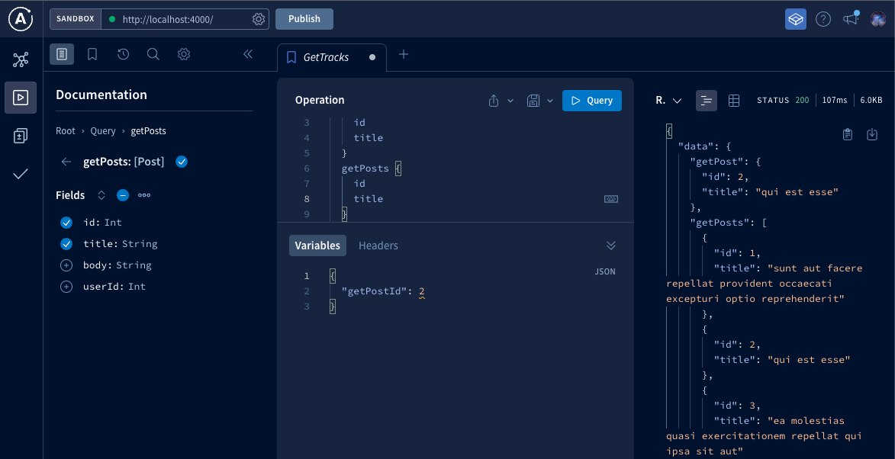

# Implementation of Apollo Server

Simple How-To in three steps:

1. Setup: What Apollo Needs to Run
2. Connection: Let's Say Data
3. Run: Bind Data, Resolvers & Endpoint

## Packages

- Server Side Packages
  - core: graphql
  - server service: apollo-server
  - data source service: apollo-datasource-rest

```bash
npm i graphql apollo-server apollo-datasource-rest
```

> Development Dependencies: nodemon

## First, What Apollo Needs to Run

The most basic setup for Apollo Server should include an Schema, even a dummy one.

### Schema

```js
const { gql } = require("apollo-server");
const typeDefs = gql`
  type Query {
    "Dumy Init"
    dummyField: String
  }
`;
module.exports = typeDefs;
```

## Basic Apollo Server

Then, It follows an Express.js Server Pattern. So, set it up alike.

```js
const { ApolloServer } = require("apollo-server");
const typeDefs = require("./schema");

async function initApolloServer(typeDefs) {
  const server = new ApolloServer({ typeDefs });
  await server.listen({ port: 4000 });
}
initApolloServer(typeDefs);
```

Now, Apollo is reachable. But It does nothing else.


## Second, Let's say Data

About the Data, three things must be said:

1. Where is the Data?
2. How the Data looks?
3. What should provide the Data?

Let's use an Endpoint which returns json data (placeholder) as https://jsonplaceholder.typicode.com/

In the Apollo Server jargon, this refers to the datasource. It's the place where the petition methods and the source location are connected.

Apollo allows for petitions to SQL, NoSQL, Cloud and REST (used here) based sources of data.

### 1. Where is the Data?

1. GET - Posts List: https://jsonplaceholder.typicode.com/posts
2. GET - Post Selected: https://jsonplaceholder.typicode.com/posts/1

This information allows to create the datasource file.

```js
const { RESTDataSource } = require("apollo-datasource-rest");
class OneSource extends RESTDataSource {
  constructor() {
    super();
    this.baseURL = "https://jsonplaceholder.typicode.com/";
  }
  getPosts() {
    return this.get("posts");
  }
  getPost(id) {
    return this.get(`posts/${id}`);
  }
}
module.exports = OneSource;
```

### 2. How the Data looks?

The Schema defines how data should looks and which data is allowed to be queried for.

```json
{
  "userId": 1,
  "id": 1,
  "title": "sunt aut facere...",
  "body": "quia et suscipit\nsuscipit..."
}
```

There would be two types of data to query for:

1. A list of all the Posts
2. A single Post

All this information allows to create the Schema file.

```js
const { gql } = require("apollo-server");
const typeDefs = gql`
  type Query {
    getPosts: [Post]
    getPost(id: Int): Post
  }
  type Post {
    "Post ID"
    id: Int
    "Title of the post"
    title: String
    "Text of the post"
    body: String
    "Author ID"
    userId: Int
  }
`;
module.exports = typeDefs;
```

### 3. What should provide the Data?

Resolvers should connect the data source methods with the data available to be queried.

Technically speaking, a Resolver is a function. But It's implemented as an object which exposes an object. This second object exposes keys that returns a function. Which is the actual resolver.

```js
const resolvers = {
  Query: {
    getPosts: () => {},
  },
};
```

The resolver validates (background process) the query and returns the data source result.

```js
const resolvers = {
  Query: {
    getPosts: (_, __, { dataSources }) => dataSources.oneEndpoint.getPosts(),
    getPost: (_, { id }, { dataSources }) =>
      dataSources.oneEndpoint.getPost(id),
  },
};
module.exports = resolvers;
```


## Third, Bind Data, Resolvers & Endpoint

Create the files is not enough, they must placed within Apollo Server. In certain way, the pattern is similar what Redux does: the library has socket or plugs prepared to receive values.

The server is prepared to respond to some specific keys, as typeDefs, resolvers and datasource.


```js
const { ApolloServer } = require("apollo-server");

const typeDefs = require("./schema");
const resolvers = require("./resolvers");
const OneEndpoint = require("./datasource");

async function initApolloServer(typeDefs) {
  const server = new ApolloServer({
    typeDefs,
    resolvers,
    dataSources: () => {
      return {
        oneEndpoint: new OneEndpoint(),
      };
    },
  });
  await server.listen({ port: process.env.PORT || 4000 });
}
initApolloServer(typeDefs);
```

> Prod implementation: process.env.PORT (host allowed)

Now, Apollo is reachable & fully functional! 🎉



---

# Run from Docker

* Server puzzledotscode/poc_server


